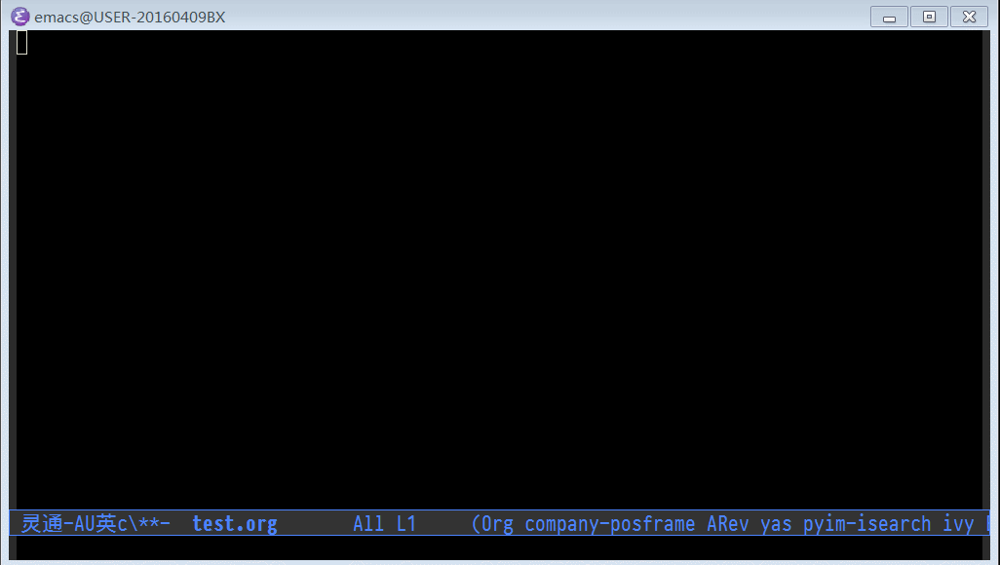

Note: this file is auto converted from org-picklink.el by [el2org](https://github.com/tumashu/el2org), please do not edit it by hand!!!

# &#30446;&#24405;

1.  [org-picklink's README](#orgc47a72d)

# org-picklink's README

This package contains the command \`org-picklink' which pops
up a org-agenda window as link chooser, user can
pick a headline in this org-agenda window, then insert
its link to origin org-mode buffer.

The simplest installation method is to call:

    (define-key org-mode-map "\C-cl" 'org-picklink)

